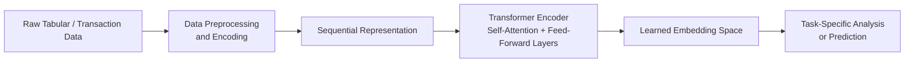

# Foundation Models for Tabular and Time-Series Data
### Transformer-Based Modeling for Structured and Transactional Datasets

## 1. Introduction

This repository presents a **research-oriented prototype** aligned with the *IITB–Optiver AI Innovation Lab* research theme **“Foundation Models for Tabular and Time-Series Data.”**  
The work demonstrates how **Transformer architectures**, originally developed for natural language processing, can be adapted to learn **generalizable and reusable representations** from **structured and temporal datasets**, such as transaction logs.
The repository is designed to be **clear, explainable, and extensible**, serving as a reference implementation for researchers exploring foundation-model concepts beyond text.

## 2. Purpose of This Repository

The primary objectives of this repository are:
- To demonstrate how **tabular and time-series data can be modeled as sequences**
- To show how **self-attention mechanisms** capture temporal and feature interactions
- To illustrate the concept of **pretrained embeddings for structured data**
- To provide a **research baseline** for further large-scale or multimodal extensions
This work focuses on **architecture and representation learning**, not production deployment.

## 3. Research Scope and Expectations

This repository should be interpreted with the following scope:
- This is a **research prototype and demonstration**
- Emphasis is on **representation learning**, not end-task optimization
- Implementations are **lightweight and illustrative**
- Large-scale pretraining and multimodal fusion are discussed conceptually
The goal is to establish **feasibility and clarity**, not to deliver a complete foundation model.

## 4. Research Themes Addressed

This repository aligns with the following official research sub-themes:
- **2.1 Transformer Architectures for Transaction Logs**
- **2.2 Pretrained Financial Embeddings**
- **2.3 Cross-Industry Temporal Foundation Models**

Conceptual extensions are outlined for:
- **2.4 Multimodal Fusion**
- **2.5 SAM-like Segmentation for Tabular Data**

## 5. Repository Structure## Repository Structure

```text
transformers-for-tabular-timeseries/
├── research_area_02.ipynb
│   └── Demonstration notebook implementing Transformer-based
│       modeling for tabular and time-series data
│
├── IITB_Optiver_Research_Proposal_02.pdf
│   └── Formal research proposal describing full methodology,
│       objectives, and planned extensions
│
└── README.md
    └── Project overview and technical explanation
```
## 6. How to Use This Repository

Recommended reading order:
1. Read this README to understand context and scope  
2. Review the attached research proposal for theoretical grounding  
3. Go through the notebook sequentially to understand the implementation  
Each section of the notebook corresponds directly to the research objectives.

## 7. Research Proposal Document

The file **`IITB_Optiver_Research_Proposal_02.pdf`** contains:
- Problem formulation
- Research objectives (2.1–2.5)
- Methodology and timeline
- Expected outcomes and deliverables
This repository provides a **working prototype and experimental demonstration** for selected components (**2.1–2.3**) of the proposal.

## 8. Technical Approach Overview

### 8.1 Core Idea

Tabular and transaction data are treated as **ordered sequences of feature vectors**, enabling the use of Transformer encoders to learn:
- Temporal dependencies
- Feature interactions
- Context-aware representations
This approach reduces dependence on manual feature engineering and task-specific models.

## 9. System Flow and Architecture

### 9.1 High-Level System Flow



### 9.2 Architectural Rationale

- **Sequential representation** enables temporal modeling
- **Self-attention** captures long-range dependencies
- **Embedding outputs** act as reusable foundation representations
- **Task heads** can be adapted without retraining the core model

## 10. Code Walkthrough: `research_area_02.ipynb`

The notebook is organized in a progressive and explainable manner.

### 10.1 Data Preparation

- Tabular data is loaded and cleaned
- Numerical features are scaled for stable training
- Data is ordered temporally to preserve sequence structure
This step ensures compatibility with Transformer architectures.

### 10.2 Tabular-to-Sequence Conversion

Each row is treated as a time step, and each column as a feature dimension.  
This enables:
- Modeling temporal patterns
- Learning inter-feature dependencies
- Meaningful application of attention mechanisms

### 10.3 Transformer Model Implementation (Theme 2.1)

**Libraries used:**
- PyTorch (`torch`, `torch.nn`)
- NumPy
- Pandas
- Scikit-learn

**Model components:**
- Input embedding layers
- Multi-head self-attention
- Feed-forward networks
- Residual connections and normalization

**Why Transformers:**
- Strong long-range dependency modeling
- Parallel computation
- Domain-agnostic architecture

### 10.4 Learning Reusable Embeddings (Theme 2.2)

The Transformer encoder outputs dense embedding vectors that capture:
- Temporal context
- Behavioral patterns
- Feature interactions
These embeddings function similarly to **BERT embeddings**, but for **tabular and time-series data**.

### 10.5 Cross-Domain Generalization (Theme 2.3)

The same encoder architecture is applied across different structured datasets without architectural changes.
This demonstrates:
- Industry-agnostic temporal learning
- Minimal task-specific adaptation
- Foundation-style model reuse

## 11. Conceptual Extensions

### 11.1 Multimodal Fusion (Theme 2.4)

Future extensions may integrate:
- Text encoders for contracts
- Vision encoders for KYC documents
- Attention-based fusion mechanisms

### 11.2 SAM-like Segmentation (Theme 2.5)

Embedding-space clustering enables:
- Automatic customer segmentation
- Transaction behavior grouping
- Label-free pattern discovery

## 12. Limitations

- Prototype-scale implementation
- Limited dataset size
- No large-scale self-supervised pretraining
These limitations are intentional and aligned with exploratory research goals.

## 13. Key Contributions

- Demonstrates foundation-model concepts for structured data
- Reduces reliance on manual feature engineering
- Provides a clear and extensible research baseline

## 14. Author

**Vrushika K Panchal**  
B.Tech in Data Science,
Research and Development, FAAIR Organization

**Yash K Dhasal**  
B.Tech in Computer Science and Technology (AI-DS),
Research and Development, FAAIR Organization

## 15. Acknowledgement

This work aligns with the research directions proposed by the **IITB–Optiver AI Innovation Lab**, 
under the guidance of **Prof. Siddhartha Duttagupta**,  
Department of Electrical Engineering, IIT Bombay.
